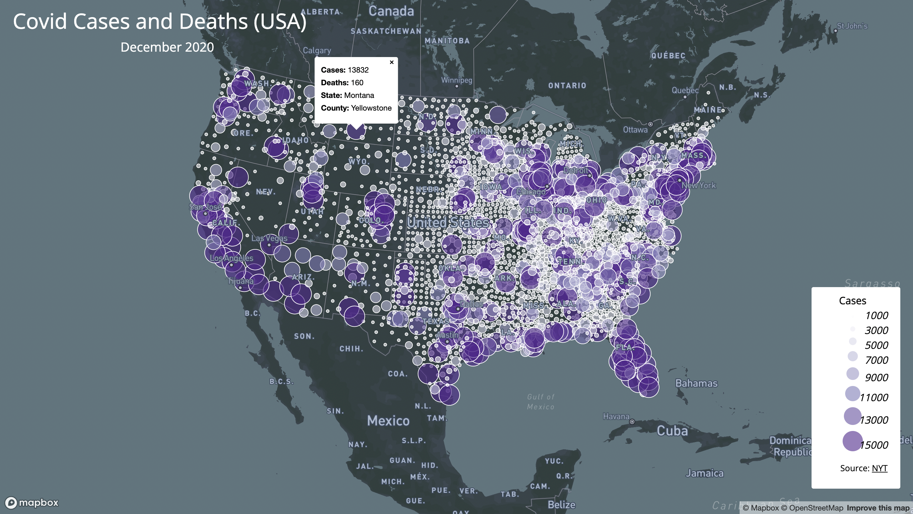
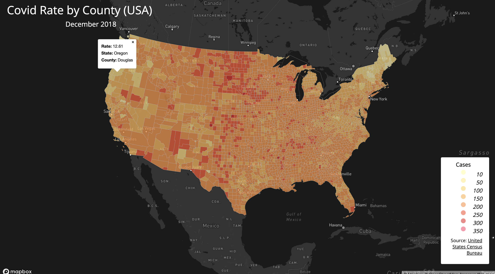

# COVID-19 Cases and Rates

This project was given during GEOG 465 with the intent of learning mapbox and visualizing data through diffrerent means.

## Map Links
- [COVID-19 Rates Choropleth Map](map1.html)

- [COVID-19 Counts Proportional Symbols Map](map2.html)

## Map Screenshots

## Sources
- [The New York Times](https://github.com/nytimes/covid-19-data/blob/43d32dde2f87bd4dafbb7d23f5d9e878124018b8/live/us-counties.csv)
- [2018 ACS 5 year estimates](https://data.census.gov/cedsci/table?g=0100000US.050000&d=ACS%205-Year%20Estimates%20Data%20Profiles&tid=ACSDP5Y2018.DP05&hidePreview=true)
- [the U.S. Census Bureau](https://www.census.gov/geographies/mapping-files/time-series/geo/carto-boundary-file.html)

## Acknowledgement
The data has been processed by Steven Bao, I appreciate Steven's assistance in creating the lab data.